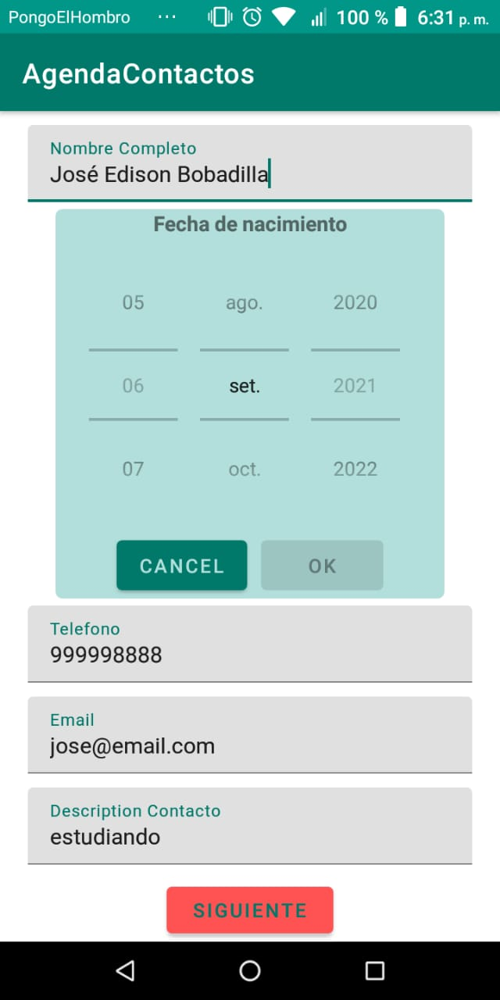
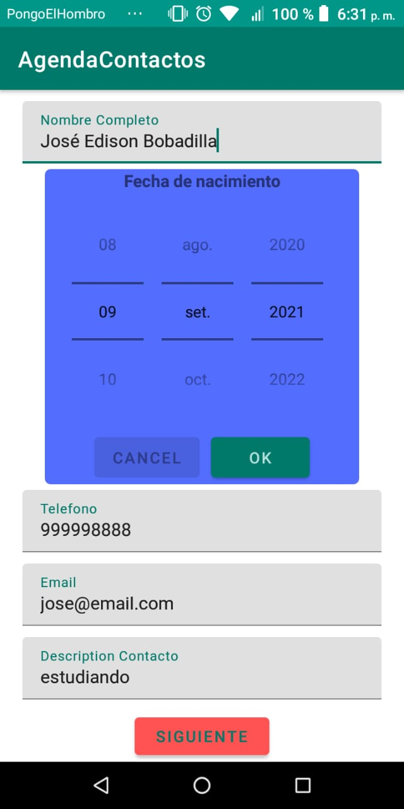
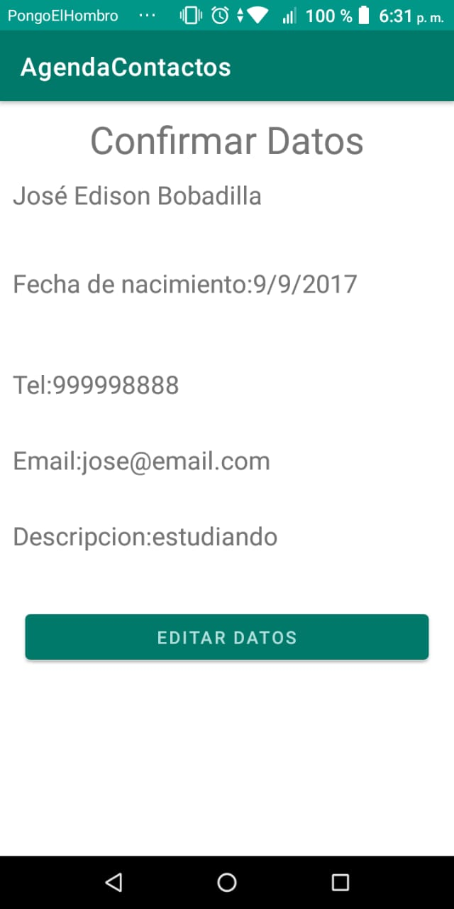

# AgendaContactos
Contact aplication

Esta aplicacion ha sido desarrollada en forma de actividad para el programa de desarrollo de aplicaciones de android de la UNAM.

En este podenemos a prueba los intents y varios de lso wigdet aprendidos durante el curso.

Esta esta compuesta de dos activities. En el principal se pueden setear los datos de el contactoa  ingresar para si posterior visualizacion en TextWigdets.Los botones cancel y ok se ha dado la funcionalidad de disable o enable el Setdate si pones en ok el registro de fechas se dara por inahilitado y no podras cambiar de fecha si pones en cancelar, se habilita y ademas el layout de fondo cambiara de color. Una vez realizado todo esto se pasara al siguiente activitie con el boton siguiente.,

El segundo activity tiene la funcion de mostrar al usuario si los valores ingresados son los correctos en caso contrario con el boton se podra regresar a la activity principal.

Algunas capturas con diferentes datos:

